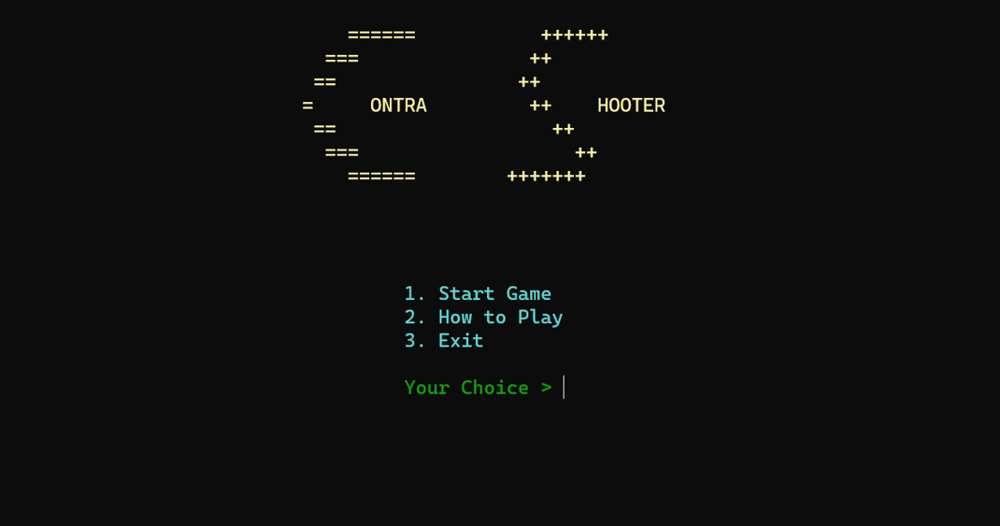
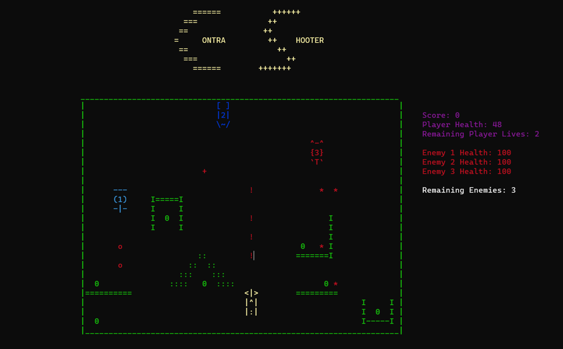

# Contra Shooter

A command-line interface (CLI) based shooter game developed in C++. Players engage in combat against three enemies, each with its own health system. The objective is to eliminate all enemies while managing limited lives, providing an engaging and strategic gameplay experience.

## Table of Contents
- [Features](#features)
- [Screenshots](#screenshots)
- [Documentation](#documentation)
- [Technologies Used](#technologies-used)
- [Usage](#usage)
- [Contributing](#contributing)
- [License](#license)
## Features
- Combat against three distinct enemies with health systems
- Players and enemies have health systems that affect gameplay
- Players have two lives to complete the game
- Track player performance throughout the game

## Screenshots

## Documentation
For a detailed overview of the gameplay mechanics and features, refer to the [Documentation](./documentation) in the repository.

## Technologies Used
- C++

## Usage
1. Clone the repository:
   `git clone https://github.com/miansaadtahir/contrashooter.git`
2. Launch the `contrashooter.exe` file
   
## Contributing
Contributions, issues, and feature requests are welcome!  
Feel free to check out the [issues page](https://github.com/miansaadtahir/contrashooter/issues).

## License

This project is open source and available under the MIT [License](https://github.com/MianSaadTahir/Contra-Shooter/blob/main/LICENSE).
